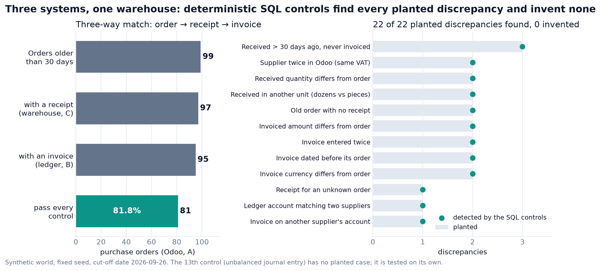
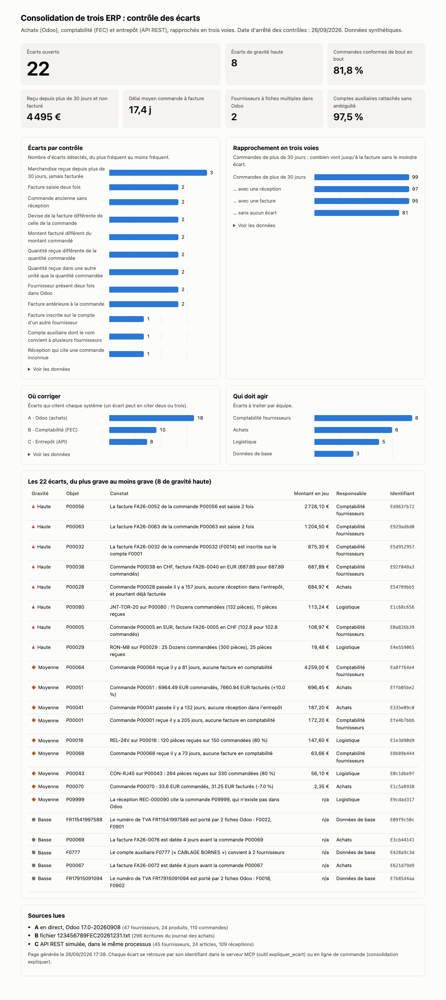

# Consolider trois ERP, contrôler les écarts, interroger le tout depuis Claude

[English version](README.md)

Trois systèmes décrivent les mêmes achats d'un groupe fictif. Sont-ils d'accord ? Ils sont lus,
rapprochés et contrôlés par des requêtes SQL déterministes, puis exposés à un tableau de bord et à un
agent (Claude) par un serveur MCP : l'agent lit les écarts trouvés par les contrôles au lieu d'en
décider lui-même.



*Figure tracée par [`scripts/hero_figure.py`](scripts/hero_figure.py) depuis l'entrepôt et la vérité
terrain commitée (libellés en anglais).*

```
 A  Odoo 17 (achats)          XML-RPC ─┐
 B  comptabilité (export FEC) fichier ─┼─► entrepôt DuckDB ─┬─► serveur MCP (6 outils) ─► Claude
 C  entrepôt logistique       API REST ┘   (modèle en étoile,│
                                            contrôles en SQL) └─► tableau de bord HTML, CSV pour Power BI
```

Le contrôle central est le **rapprochement en trois voies** : la commande (A), la réception (C) et la
facture (B) doivent dire la même chose sur le fournisseur, les quantités, les montants, les dates et la
devise.

## Ce qui est réel, ce qui est simulé

| | Nature |
|---|---|
| **A, Odoo 17** | **Un vrai Odoo 17.0**, dans Docker, avec le module achats. Lu par XML-RPC. |
| **B, comptabilité** | Un fichier au **vrai format FEC** (18 colonnes, tabulations, virgule décimale, cp1252). Écrit par la maquette, pas par un logiciel de comptabilité. |
| **C, entrepôt** | Une **API REST simulée** (clé d'API, pagination, réessais). Il n'y a pas de logiciel d'entrepôt derrière. |
| Les données | Synthétiques : noms, numéros de TVA, montants. Déterministes (graine fixe). |

Un seul des trois systèmes est un vrai ERP. Ce que la maquette démontre, c'est la méthode, pas une
intégration de trois ERP du commerce.

## Démarrer

Prérequis : [uv](https://docs.astral.sh/uv/). Docker seulement si l'on veut le vrai Odoo.

```bash
uv sync
uv run consolidation actualiser      # lit A, B, C, reconstruit l'entrepôt : 22 écarts
uv run consolidation ecarts          # la liste, du plus grave au moins grave
uv run consolidation expliquer <id>  # un écart, avec ses sources dans chaque système
uv run consolidation tableau-de-bord # écrit tableau_de_bord/index.html
```

Sans Docker, Odoo est lu dans `data/odoo_instantane.json`, un export du vrai Odoo commité avec le dépôt
(`ODOO_MODE=instantane`, ou automatiquement si Odoo ne répond pas ; la source lue est toujours affichée).

Avec le vrai Odoo :

```bash
./scripts/odoo_up.sh                 # démarre Odoo 17 et crée la base (admin / admin, instance jetable)
uv run consolidation generer         # sème Odoo, écrit le FEC, l'entrepôt logistique et l'instantané
uv run consolidation actualiser      # Odoo est alors lu en direct
```

## Les écarts

Le monde de démonstration est parfaitement cohérent. On y **plante 22 écarts connus**, puis on exige
que les contrôles les retrouvent **tous, et rien d'autre** (`tests/test_controles.py`).

| Contrôle | Gravité | Responsable | Plantés |
|---|---|---|---|
| Facture saisie deux fois | haute | Comptabilité fournisseurs | 2 |
| Facture inscrite sur le compte d'un autre fournisseur | haute | Comptabilité fournisseurs | 1 |
| Devise de la facture différente de celle de la commande | haute | Comptabilité fournisseurs | 2 |
| Quantité reçue dans une autre unité (douzaines et pièces) | haute | Logistique | 2 |
| Commande ancienne sans réception (haute si déjà facturée) | moyenne | Achats | 2 |
| Marchandise reçue depuis plus de 30 jours, jamais facturée | moyenne | Comptabilité fournisseurs | 3 |
| Montant facturé différent du montant commandé | moyenne | Achats | 2 |
| Quantité reçue différente de la quantité commandée | moyenne | Logistique | 2 |
| Réception qui cite une commande inconnue | moyenne | Logistique | 1 |
| Facture antérieure à la commande | basse | Achats | 2 |
| Fournisseur présent deux fois dans Odoo (même TVA) | basse | Données de base | 2 |
| Compte auxiliaire dont le nom convient à deux fournisseurs | basse | Données de base | 1 |
| Écriture comptable déséquilibrée | haute | Comptabilité fournisseurs | 0, testé à part |

Deux cas montrent pourquoi le rapprochement des fournisseurs compte. Deux fournisseurs ont une seconde
fiche dans Odoo, avec le même numéro de TVA, et leurs factures restent sur le compte de la première :
sans dédoublonnage par TVA, chacune serait signalée à tort comme « facture sur le mauvais fournisseur ».
À l'inverse, un compte comptable dont le nom convient à deux fournisseurs différents **n'est pas rattaché
au hasard** : il est signalé, et sa facture n'est pas attribuée.

Chaque écart cite ses sources : l'identifiant Odoo, le **numéro de ligne du FEC**, la référence de
réception. C'est ce qui permet de dire à quelqu'un où corriger, et dans quel système.

## Le serveur MCP

Six outils. Cinq sont en lecture seule et lisent l'entrepôt de données, jamais les ERP.

| Outil | Rôle |
|---|---|
| `decrire_modele` | tables et colonnes, à appeler avant d'écrire une requête |
| `lister_indicateurs` | 8 indicateurs, leur définition, leur valeur, et les sources lues |
| `ecarts_ouverts` | la liste des écarts, filtrable par gravité et par contrôle |
| `expliquer_ecart` | constat, règle, enregistrements de chaque système, responsable, action |
| `requete_lecture_seule` | un `SELECT` DuckDB, 10 secondes et 1000 lignes au plus |
| `rafraichir` | relit A, B et C et reconstruit l'entrepôt ; dit ce qui est nouveau ou résolu |

Les instructions du serveur demandent à Claude de **citer le système et l'identifiant** de chaque
enregistrement, et de n'affirmer aucun écart que `ecarts_ouverts` ne liste pas.

### La requête libre est bornée par trois barrières indépendantes

1. le fichier est ouvert **en lecture seule**, sans accès aux fichiers ni au réseau, configuration
   verrouillée ;
2. une seule instruction, de type `SELECT` ;
3. un délai de 10 secondes, après lequel la requête est interrompue.

Un filtre de mots interdits vient en plus. La lecture seule et le refus d'accès aux fichiers sont testés
**en contournant ce filtre** ; le verrouillage de la configuration, le délai et la limite de 1 000 lignes
ont leurs propres tests (`tests/test_garde_sql.py`). L'accès réseau est coupé par le même réglage, sans
test dédié. Les messages de refus sont faits pour être lus par Claude : il peut
corriger sa requête.

### Brancher Claude Desktop

Dans `~/Library/Application Support/Claude/claude_desktop_config.json` (macOS), en remplaçant les deux
chemins par les vôtres : celui d'`uv` (`which uv`) et celui de ce dépôt. Claude Desktop ne connaît pas votre
`PATH`, il faut donc un chemin absolu vers `uv`.

```json
{
  "mcpServers": {
    "consolidation-erp": {
      "command": "/chemin/absolu/vers/uv",
      "args": ["--directory", "/chemin/absolu/vers/consolidation-erp-mcp", "run", "consolidation-mcp"]
    }
  }
}
```

Puis redémarrer Claude Desktop. Dans Claude Code :
`claude mcp add consolidation-erp -- /chemin/absolu/vers/uv --directory /chemin/absolu/vers/consolidation-erp-mcp run consolidation-mcp`.

Trois questions pour l'essayer, avec la réponse attendue :

1. « Où en est la qualité des données consolidées ? » : 22 écarts, dont 8 de gravité haute ; 81,8 % des
   commandes de plus de 30 jours passent tous les contrôles.
2. « Quels sont les écarts les plus graves, et qui doit agir ? » : la facture FA26-0052 saisie deux fois
   (2 728 €), à contre-passer par la comptabilité fournisseurs.
3. « Quels fournisseurs existent sous deux codes dans Odoo, et est-ce un problème ? » : F0018 et F0902,
   F0022 et F0901 ; le rapprochement les traite comme un seul fournisseur.

Puis pour voir le rafraîchissement : « J'ai saisi la facture manquante de la commande P00068 » (après
`uv run consolidation corriger <id>`), et Claude appelle `rafraichir` : 22 écarts deviennent 21.

## Le tableau de bord

`uv run consolidation tableau-de-bord` écrit une page HTML autonome : tuiles, écarts par contrôle,
rapprochement en trois voies, où corriger, qui doit agir, et la liste complète. Une seule teinte pour
les barres, des puces de gravité avec icône et libellé, infobulles, vue tableau, clair et sombre.



**Power BI.** Le dossier [`powerbi/`](powerbi/README.md) contient les CSV du modèle en étoile, les
relations, les mesures DAX et la table de vérification des chiffres. **Il n'a jamais été ouvert dans
Power BI Desktop** (développé sur un Mac). Les huit indicateurs sont en revanche recalculés depuis les
CSV par un test, ce qui valide leurs colonnes et leur logique, pas la syntaxe DAX.

## Ce qui n'a pas été vérifié

- **Claude Desktop** : le serveur est testé par un client MCP (en mémoire et en sous-processus stdio,
  lancé avec un environnement minimal : seules les variables que le client MCP transmet par défaut),
  pas encore depuis son interface.
- **Ce que dit l'agent n'est pas testé.** Citer ses sources et n'affirmer aucun écart non listé sont des
  consignes données au modèle, pas une contrainte imposée. Les tests portent sur ce que rendent les
  outils, pas sur les réponses du modèle.
- **Power BI et Tableau** : voir plus haut.
- **Odoo** : une seule instance, en version 17.0, avec le module achats seul. Pas de multi-société, pas
  de taxes, pas de réceptions Odoo (l'entrepôt est le système C).
- **Le taux de change** est fixe (1 CHF = 1,06 EUR). Un vrai projet lirait les taux du jour.
- **L'actualisation reconstruit tout** au lieu de lire les seuls changements. Elle est idempotente et
  rapide à cette échelle (une seconde). Un connecteur de production lirait en incrémental sur
  `write_date`, ce que celui-ci ne fait pas.
- **Données synthétiques** : les écarts plantés sont ceux que j'ai imaginés. Les retrouver exactement
  prouve que les contrôles font ce qu'ils annoncent, pas qu'ils couvrent toutes les défaillances d'une
  vraie clôture.

## Tests

```bash
uv run pytest        # 69 tests sans Odoo ; 3 de plus contre le vrai Odoo, ignorés s'il ne répond pas
```

Les tests qui comptent : les contrôles retrouvent exactement les écarts plantés ; l'actualisation est
idempotente et ses identifiants d'écart sont stables ; corriger un écart à la source le fait disparaître,
lui seul ; la lecture seule et le refus d'accès aux fichiers sont prouvés en contournant le filtre de
mots, et le verrouillage, le délai et la limite de lignes ont leurs propres tests ; le serveur MCP est
appelé par un vrai client, jusqu'en sous-processus stdio. Les tests contre le vrai Odoo (`-m odoo`) sont
ignorés si l'instance ne répond pas.

## Le dépôt

| | |
|---|---|
| `src/consolidation_erp/monde.py` | le monde de démonstration et ses écarts plantés |
| `odoo.py`, `fec.py`, `erp_c.py` | les trois lecteurs, un par système |
| `sql/modele.sql` | du brut au modèle en étoile |
| `regles.py` | les contrôles, une requête SQL chacun |
| `entrepot.py` | construction atomique, indicateurs, requête libre bornée |
| `pipeline.py` | l'actualisation, appelée par la ligne de commande et par le serveur MCP |
| `mcp_server.py` | le serveur MCP |
| `demo.py` | générer les sources ; corriger un écart à la source |
| `tableau_de_bord.py`, `export_bi.py` | les deux livrables |
| `data/` | les sources générées (FEC, jeu de données de l'entrepôt, instantané d'Odoo) |
